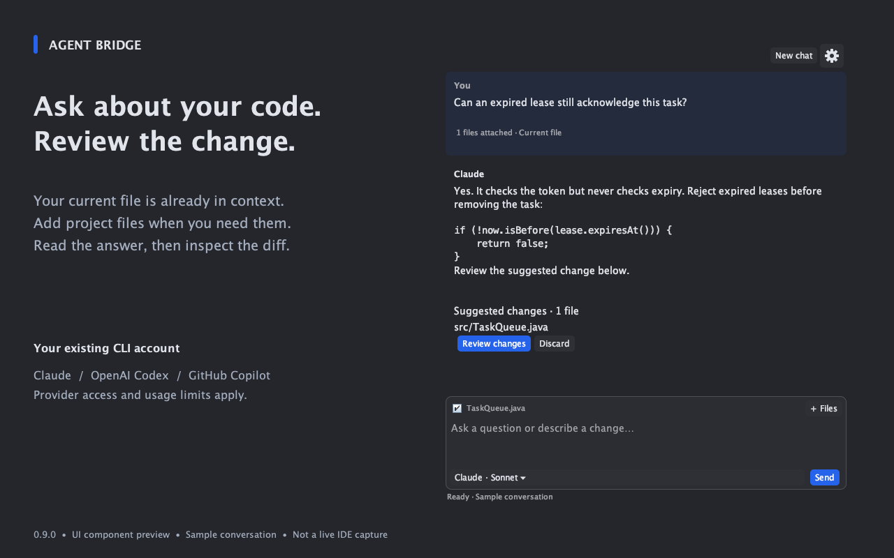
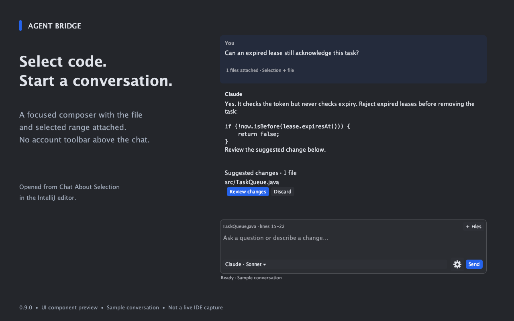
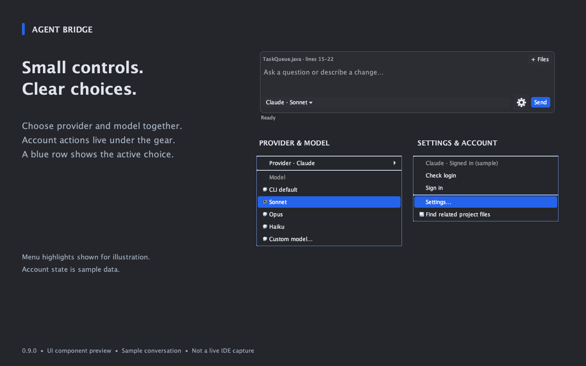
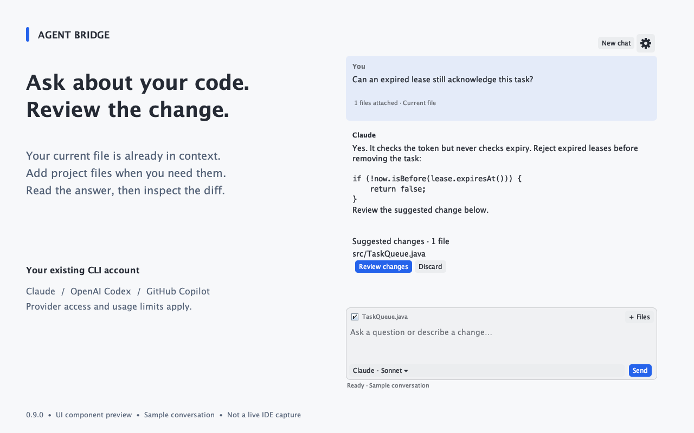

# Agent Bridge

**Ask about code. Review changes. Stay in IntelliJ.**

Agent Bridge brings code conversations into IntelliJ IDEA using your installed Claude Code, OpenAI Codex or GitHub Copilot CLI. Ask about the file you are editing, select a few lines and open a nearby chat, or add relevant project files before requesting a change.

The interface puts the question and response first: a compact composer, a small provider/model selector, and account controls behind a gear menu. Suggested edits are presented for review before you apply them to editor buffers.

No JetBrains AI subscription is required. You need access to a supported provider through its CLI; provider charges, subscriptions, quotas and organization policies still apply. Agent Bridge is an independent integration, not an official product of JetBrains, Anthropic, OpenAI or GitHub.

## Start with the code in front of you

Open the sidebar to discuss the current file, including its unsaved editor content. Ask a question such as:

> Explain how this queue prevents duplicate acknowledgements. Identify any edge cases in the current implementation.

Your code stays visible while the response streams into the conversation. Ask a follow-up or request a concrete improvement in the same chat.

*Component preview from version 0.9.0 with a synthetic conversation, not a live IDE screenshot.*

## Ask beside a selection

Select code and click the chat icon in the gutter, or right-click and choose **Chat About Selection**. A compact popup opens beside the selected code. It begins with the composer rather than a setup screen, then expands when the conversation starts.

The popup includes the selected code and its surrounding file. It stays tied to that file when you switch editor tabs. Questions can be as short as:

> Why do we check the lease token here?

> Suggest a clearer version of this method and explain the tradeoff.

*The preview shows the actual chat component. The editor anchor and gutter placement need a live IDE capture.*

## Add the context that matters

Use **+ Files** to pick files or folders from IntelliJ’s project tree. You can also select items in the Project pane and choose **Add to Agent Bridge**.

For broader questions, enable **⚙ → Find related project files**. Agent Bridge selects a bounded set of relevant files using paths, filenames and source-text matches. It does not upload an entire repository or build a semantic embedding index. Your explicitly chosen files and current editor buffer take priority.

The sidebar enables automatic project discovery by default. Selection chat starts with it off. A response’s context details identify the full buffers attached to that request. The underlying CLI may also use its read/search tools, subject to its configuration and policies.

## Choose an account connection and model

Click the compact control, for example **Claude · Sonnet ▾**. The Provider submenu changes the CLI/account connection; model choices apply through that provider.

| Provider | Choices in 0.9.0 | Sign-in approach |
| --- | --- | --- |
| Claude Code | CLI default, Sonnet, Opus, Haiku, custom model ID | Installed Claude CLI browser login; organization SSO option |
| OpenAI Codex | CLI default, models returned by the CLI, custom model ID | Codex-managed ChatGPT browser or device-code flow |
| GitHub Copilot CLI | CLI default, Auto, custom model ID | Installed Copilot CLI login in IntelliJ Terminal |

**Default** uses the CLI’s configured setting; it is not a claim about a resolved model version. Account entitlements still determine which choices work. Model selections are remembered per provider. Switching provider or model offers Continue with context, Start fresh, or Cancel.

*Menu preview with sample state. Available Codex models and account status depend on the installed CLI and account.*

## Review before applying

Ask for a reviewable change, then click **Review changes** beneath the response. Agent Bridge opens IntelliJ’s diff view so you can inspect the proposed result before choosing **Apply change** or **Apply all changes**.

Applied changes use the editor’s Undo mechanism. If a target file has changed since the request, the plugin rejects the stale proposal and preserves your edits. An ordinary code example in a reply is not automatically treated as an applicable patch.

Edits currently target existing, attached text files. Creating, deleting or renaming files is not supported. Selecting code focuses the request; it does not restrict a proposal to those exact lines. Always inspect the diff.

## Designed around the conversation

- Current-file context includes unsaved text.
- Inline conversations remain anchored to their original file.
- Smaller controls leave the main area for responses.
- Dark and light themes use theme-aware surfaces and text.
- Hover, pressed, keyboard-focus and open-menu states make controls easier to follow.
- Stop ends the active request; New chat starts a fresh sidebar conversation.

*Component preview using synthetic content. Native IntelliJ controls can differ.*

## Requirements and current scope

The descriptor supports IntelliJ IDEA **2024.3.2.2 through 2026.2.x**, builds **243.23654.189 through 262.***. The release compiles against the minimum Community SDK and declares no Ultimate-only dependency. See [compatibility evidence](../docs/COMPATIBILITY.md) for tested builds and limits. Other IDE products and a broad native operating-system matrix have not been verified.

Install at least one supported CLI and obtain access to that provider. Enable IntelliJ’s bundled Terminal plugin for button-based Claude/Copilot login. Codex login does not require that Terminal integration.

The plugin is a conversational assistant with explicit edit review. It does not provide ghost-text completion, image input, autonomous background implementation, persistent IDE chat history, or full feature parity with another AI editor.

## Questions before installing

**Is the AI usage free?** No additional JetBrains AI subscription is required by this plugin. Your provider’s plan, usage limits or API billing still apply. The recommended Marketplace distribution is a free plugin; this does not make provider inference free.

**Do I enter API keys into Agent Bridge?** There is no credential-entry field. The installed CLI manages authentication. Existing CLI API-key or enterprise configuration can affect how requests are billed and routed.

**Does the model see my code?** Sending a question passes the selected context to the provider CLI. Its service may process that context remotely. Consult the data-handling guide and your organization’s rules before sending private code.

**Is the entire project sent?** No. Automatic discovery selects a bounded set of relevant files. Explicit folders also act as search scopes. CLI read tools may inspect more files independently.

**Where do settings live?** The plugin stores selected provider, model ID, executable path and sign-in mode in IDE settings. CLI credentials and provider-controlled histories remain the CLI’s responsibility.

**Can I use different providers in one conversation?** Yes: choose Continue with context when switching. The next question sends bounded recent completed exchanges to the new provider; it does not migrate native tool state. Start fresh discards that history. Inline and sidebar chats are separate.

**What happens when I close inline chat?** Its active session is cancelled and its visible transcript is discarded. Closing a chat does not erase provider-side or CLI-managed history.

**What is verified today?** The current build passes 167 automated checks. Those are not a substitute for Marketplace Plugin Verifier results or live compatibility testing. See the release checklist for remaining coverage.

## First useful task

Install your provider CLI, sign in, open a source file, and ask:

> Explain this file and point out one improvement. Do not change anything yet.

Then follow up:

> Provide a reviewable change for that improvement, using the current file.

This exercises the central workflow: understand the code, inspect a proposal, apply deliberately.
